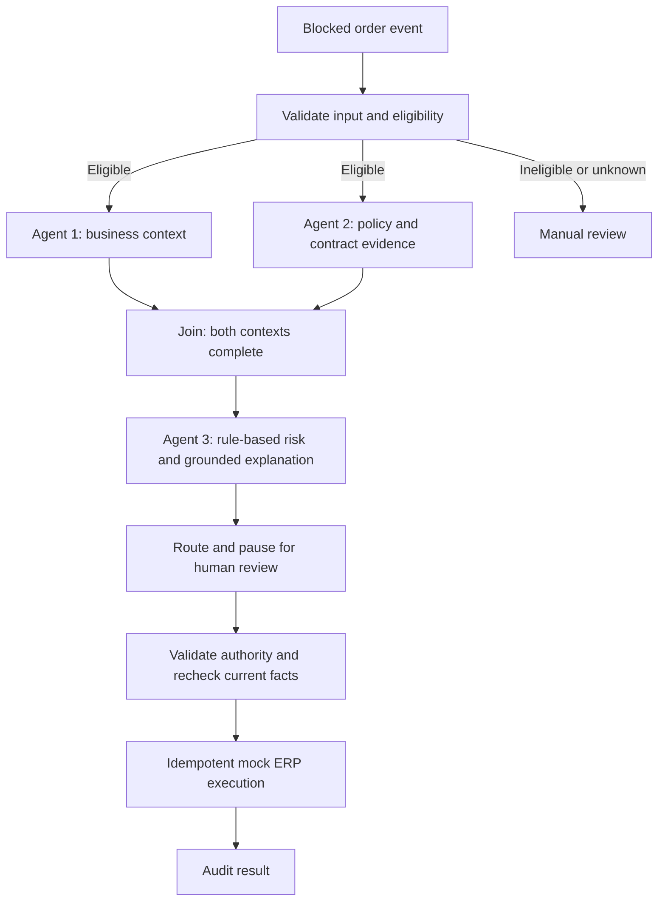

# Agentic Order Exception Workflow

A portfolio prototype for reviewing credit-blocked B2B orders using business context, document evidence, deterministic rules, and human approval.

**Status: Milestone 1 — validated order input and eligibility gate.** The multi-agent workflow, retrieval, reviewer interface, and execution adapter are planned, not yet implemented. All examples are synthetic. No live ERP or financial actions are connected.

## Business problem

A blocked order may require more context than a credit-limit error provides. A reviewer needs payment history, commercial context, applicable contract clauses, permitted alternatives, and an explanation of the recommendation in one case file.

## Run the first milestone

Python 3.9 or later; no third-party dependencies or API keys are needed for this milestone.

```bash
PYTHONPATH=src python3 -m order_exception
PYTHONPATH=src python3 -m unittest discover -s tests -v
```

The demo loads three synthetic events: an eligible order, a hard-stop order, and an order with an unknown hard-stop flag. An eligible order is admitted for analysis; it is not approved or released.

## Architecture



The orchestrator owns transitions and pause/resume. Collectors do not make credit decisions. Risk classification and routing use explicit rules. LLM output cannot override them. Every POC case requires human review.

## Implementation roadmap

- [x] Milestone 1: event validation, deterministic eligibility, synthetic demo, tests.
- [ ] Milestone 2: finalize case state, reviewer authority, mock ERP/CRM collectors.
- [ ] Milestone 3: approved synthetic policy, contract and SOP; retrieval with evidence.
- [ ] Milestone 4: risk rules, allowed actions, recommendation and fallback explanation.
- [ ] Milestone 5: LangGraph orchestration and durable human review.
- [ ] Milestone 6: safe mock execution, duplicate handling and audit trail.
- [ ] Milestone 7: simple review UI, scenario evaluation and portfolio demo.

Python and LangGraph are the planned workflow stack. FastAPI and Next.js were discussed for the application interface. LLM provider and retrieval storage remain undecided.

## Project notes

- [Case state contract](docs/state-contract.md)
- [Decisions and open questions](docs/decisions.md)
- [Learning and collaboration guide](docs/learning-guide-ru.md)
- [CV wording and evidence](docs/cv-evidence.md)

Business thresholds are illustrative POC assumptions. This repository makes no measured claims about revenue recovery, processing time savings, or production readiness.
